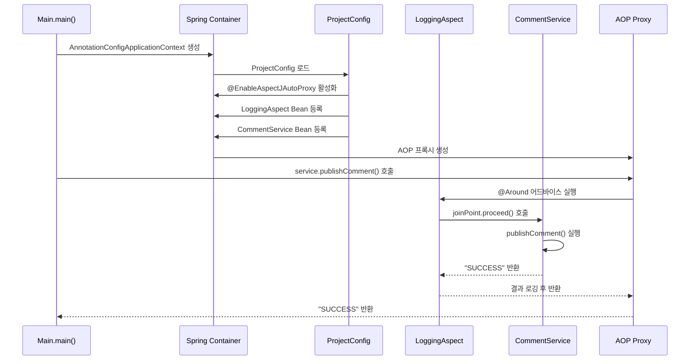

# Spring AOP 프로젝트 실행 흐름도

## 플로우차트

```mermaid
flowchart TD
    A[프로그램 시작<br/>Main.main()] --> B[Spring 컨테이너 생성<br/>AnnotationConfigApplicationContext]
    B --> C[ProjectConfig 로드<br/>@EnableAspectJAutoProxy<br/>@Bean 등록]
    C --> D[Bean 생성<br/>- LoggingAspect<br/>- SecurityAspect<br/>- CommentService]
    D --> E[AOP 프록시 생성<br/>CommentService 프록시]
    E --> F[메서드 호출<br/>service.publishComment()]
    F --> G{@ToLog<br/>어노테이션<br/>체크}
    
    G -->|있음| H[LoggingAspect 실행<br/>@Around]
    G -->|없음| I[실제 메서드 실행<br/>publishComment()]
    
    H --> J[실제 메서드 실행<br/>publishComment()]
    J --> K[LoggingAspect 완료<br/>결과 로깅]
    I --> L[결과 반환<br/>"SUCCESS"]
    K --> L
    
    L --> M[프로그램 종료]
    
    style A fill:#a5d8ff
    style B fill:#b2f2bb
    style C fill:#ffd8a8
    style D fill:#ffec99
    style E fill:#d0bfff
    style F fill:#ffc9c9
    style G fill:#fff3bf
    style H fill:#ffd8a8
    style I fill:#b2f2bb
    style J fill:#b2f2bb
    style K fill:#ffd8a8
    style L fill:#a5d8ff
    style M fill:#ffc9c9
```

## 시퀀스 다이어그램



## 주요 포인트

### 🔧 설정 단계
- **@EnableAspectJAutoProxy**: AOP 프록시 자동 생성 활성화
- **@Bean 등록**: LoggingAspect와 CommentService를 Spring Bean으로 등록

### 🎯 실행 단계
- **프록시 생성**: Spring이 CommentService에 대한 AOP 프록시 자동 생성
- **어노테이션 체크**: @ToLog 어노테이션이 붙은 메서드 감지
- **자동 인터셉션**: Spring AOP가 LoggingAspect를 자동으로 실행

### 🔄 AOP 동작 원리
- **@Around**: 메서드 실행 전후에 로깅 처리
- **joinPoint.proceed()**: 실제 메서드 실행
- **자동 로깅**: 메서드 호출과 결과를 자동으로 로깅

## 파일 구조

```
src/main/java/
├── main/
│   └── Main.java                    # 메인 클래스
├── config/
│   └── ProjectConfig.java           # Spring 설정
├── aspects/
│   ├── LoggingAspect.java          # 로깅 Aspect
│   ├── SecurityAspect.java         # 보안 Aspect
│   └── ToLog.java                  # 커스텀 어노테이션
├── services/
│   └── CommentService.java         # 비즈니스 로직
└── model/
    └── Comment.java                # 도메인 모델
```

## 핵심 코드

### LoggingAspect.java
```java
@Aspect
public class LoggingAspect {
    @Around(value = "@annotation(ToLog)")
    public Object log(ProceedingJoinPoint joinPoint) throws Throwable {
        // 메서드 실행 전 로깅
        Object returnedValue = joinPoint.proceed(); // 실제 메서드 실행
        // 메서드 실행 후 로깅
        return returnedValue;
    }
}
```

### CommentService.java
```java
@Service
public class CommentService {
    @ToLog  // 이 어노테이션으로 인터셉션 트리거
    public String publishComment(Comment comment) {
        return "SUCCESS";
    }
}
```

### ProjectConfig.java
```java
@Configuration
@EnableAspectJAutoProxy  // AOP 프록시 자동 생성
public class ProjectConfig {
    @Bean
    public LoggingAspect loggingAspect() {
        return new LoggingAspect();
    }
}
```

